# Link Aero — Supabase Architecture

> **Version**: 1.0  
> **Date**: 2026-03-14  
> **Status**: Architecture Blueprint — Pre-Implementation

---

## 1. Overview

Link Aero is a ground handling operations management system for Egyptian airports. This document defines the complete Supabase backend architecture to replace the current localStorage + mock-data + fake-auth approach with a production-ready, secure, and scalable system.

### Roles

| Role | Access Level |
|------|-------------|
| `admin` | Full CRUD on all tables, user management, financial data |
| `station_manager` | Full CRUD for assigned station(s), read-only financials |
| `station_ops` | CRUD on operational data (flights, service reports, lost & found) for assigned station(s) |
| `employee` | Read-only on most data, CRUD on own timesheets/assigned tasks |

---

## 2. Entity-Relationship Diagram

```mermaid
erDiagram
    %% ===== AUTH & USERS =====
    profiles ||--o{ user_roles : has
    profiles ||--o{ user_stations : assigned_to
    profiles {
        uuid id PK
        text full_name
        text avatar_url
        text phone
        text department
        text employee_id
        timestamptz created_at
        timestamptz updated_at
    }
    user_roles {
        uuid id PK
        uuid user_id FK
        app_role role
    }
    user_stations {
        uuid id PK
        uuid user_id FK
        uuid station_id FK
    }

    %% ===== REFERENCE DATA =====
    stations {
        uuid id PK
        text code
        text name
        text city
        text country
        boolean active
    }
    airlines ||--o{ aircrafts : owns
    airlines ||--o{ contracts : has
    airlines ||--o{ flight_schedules : operates
    airlines {
        uuid id PK
        text iata_code
        text icao_code
        text name
        text country
        text contact_person
        text email
        text phone
        text status
        timestamptz created_at
    }
    aircrafts {
        uuid id PK
        uuid airline_id FK
        text registration
        text aircraft_type_code
        text model
        numeric mtow
        int seats
        text certificate_no
        date issue_date
        text status
    }
    aircraft_types {
        uuid id PK
        text icao_code
        text iata_code
        text name
        text category
        numeric mtow
        text seat_range
    }
    delay_codes {
        uuid id PK
        text code
        text category
        text description
        text responsible
        text impact_level
        int avg_minutes
        boolean active
    }

    %% ===== OPERATIONS =====
    flight_schedules {
        uuid id PK
        uuid airline_id FK
        text flight_no
        text origin
        text destination
        time departure
        time arrival
        text aircraft_type
        text days
        text status
        text terminal
        uuid station_id FK
    }
    overfly_records ||--o{ stations : via
    overfly_records {
        uuid id PK
        text flight_no
        text operator
        text registration
        text aircraft_type
        text route_from
        text route_to
        text entry_point
        text exit_point
        text altitude
        date overfly_date
        time entry_time
        time exit_time
        text mtow
        text permit_no
        text status
        numeric fee
        text currency
    }
    service_reports ||--o{ service_report_delays : has
    service_reports {
        uuid id PK
        uuid airline_id FK
        uuid station_id FK
        uuid aircraft_id FK
        text handling_type
        text flight_no
        text mtow
        text route
        date arrival_date
        date departure_date
        text day_night
        time sta
        time std
        time td
        time co
        time ob
        time takeoff
        interval ground_time
        int pax_in_adult_intl
        int pax_in_inf_intl
        int pax_in_adult_dom
        int pax_in_inf_dom
        int pax_transit
        text project_tags
        text checkin_system
        text performed_by
        numeric civil_aviation_fee
        numeric handling_fee
        numeric airport_charge
        numeric total_cost
        text currency
        uuid created_by FK
        timestamptz created_at
    }
    service_report_delays {
        uuid id PK
        uuid service_report_id FK
        text delay_code
        int delay_minutes
        text explanation
    }
    lost_found_items {
        uuid id PK
        uuid station_id FK
        date report_date
        text flight_no
        text airline
        text category
        text description
        text color
        text brand
        text owner_name
        text owner_contact
        text storage_location
        text status
        date claim_date
        text notes
        uuid reported_by FK
        timestamptz created_at
    }
    staff_roster {
        uuid id PK
        uuid user_id FK
        uuid station_id FK
        text shift_type
        time shift_start
        time shift_end
        text status
        date cert_expiry
    }

    %% ===== FINANCIAL =====
    contracts {
        uuid id PK
        text contract_no
        uuid airline_id FK
        date start_date
        date end_date
        text services
        text stations
        text currency
        numeric annual_value
        text status
        boolean auto_renew
        text notes
        timestamptz created_at
    }
    invoices ||--o{ invoice_line_items : has
    invoices {
        uuid id PK
        text invoice_no
        date invoice_date
        date due_date
        uuid airline_id FK
        text flight_ref
        text description
        numeric subtotal
        numeric vat
        numeric total
        text currency
        text status
        text notes
        uuid created_by FK
        timestamptz created_at
    }
    invoice_line_items {
        uuid id PK
        uuid invoice_id FK
        text category
        text description
        numeric amount
    }

    %% ===== PRICING / REFERENCE =====
    airport_charge_vendors {
        uuid id PK
        text name
        text calc_type
        jsonb calc_params
    }
    service_prices {
        uuid id PK
        text category
        text service_name
        text unit
        numeric price
        text currency
        text airport_code
        boolean active
        timestamptz effective_from
    }
    catering_items {
        uuid id PK
        text item
        text unit
        numeric price
        text currency
        text category
        boolean active
    }

    %% ===== QUALITY & SAFETY =====
    bulletins {
        uuid id PK
        text title
        text type
        date issued_date
        date effective_date
        date expiry_date
        text issued_by
        text status
        text priority
        text description
    }
    manuals_forms {
        uuid id PK
        text title
        text category
        text version
        date last_updated
        text department
        text status
        text file_url
    }

    %% ===== REFERENCE / MISC =====
    abbreviations {
        uuid id PK
        text abbr
        text full_name
    }
```



---

## 3. Database Schema (SQL)

### 3.1 Enums

```sql
-- Roles
CREATE TYPE public.app_role AS ENUM ('admin', 'station_manager', 'station_ops', 'employee');

-- Statuses
CREATE TYPE public.airline_status AS ENUM ('Active', 'Inactive', 'Suspended');
CREATE TYPE public.aircraft_status AS ENUM ('Operational', 'Maintenance', 'Grounded');
CREATE TYPE public.flight_status AS ENUM ('Scheduled', 'Delayed', 'Cancelled', 'Completed');
CREATE TYPE public.invoice_status AS ENUM ('Draft', 'Sent', 'Paid', 'Overdue', 'Cancelled');
CREATE TYPE public.contract_status AS ENUM ('Active', 'Expired', 'Pending', 'Terminated');
CREATE TYPE public.overfly_status AS ENUM ('Approved', 'Pending', 'Rejected', 'Expired');
CREATE TYPE public.lost_found_status AS ENUM ('Reported', 'In Storage', 'Claimed', 'Forwarded', 'Disposed');
CREATE TYPE public.staff_status AS ENUM ('Active', 'On Leave', 'Training', 'Suspended');
CREATE TYPE public.bulletin_status AS ENUM ('Active', 'Expired', 'Draft', 'Superseded');
CREATE TYPE public.bulletin_priority AS ENUM ('High', 'Medium', 'Low');
CREATE TYPE public.manual_status AS ENUM ('Current', 'Under Review', 'Archived');
```

### 3.2 Core Tables

All tables use `uuid` primary keys with `gen_random_uuid()` defaults and `timestamptz` audit columns.

---

## 4. Row-Level Security (RLS) Strategy

### 4.1 Security-Definer Helper Functions

```sql
-- Check if user has a specific role
CREATE OR REPLACE FUNCTION public.has_role(_user_id uuid, _role app_role)
RETURNS boolean
LANGUAGE sql STABLE SECURITY DEFINER
SET search_path = public
AS $$
  SELECT EXISTS (
    SELECT 1 FROM public.user_roles
    WHERE user_id = _user_id AND role = _role
  )
$$;

-- Check if user is assigned to a specific station
CREATE OR REPLACE FUNCTION public.user_has_station(_user_id uuid, _station_id uuid)
RETURNS boolean
LANGUAGE sql STABLE SECURITY DEFINER
SET search_path = public
AS $$
  SELECT EXISTS (
    SELECT 1 FROM public.user_stations
    WHERE user_id = _user_id AND station_id = _station_id
  )
$$;

-- Check if user is admin or station_manager
CREATE OR REPLACE FUNCTION public.is_manager_or_admin(_user_id uuid)
RETURNS boolean
LANGUAGE sql STABLE SECURITY DEFINER
SET search_path = public
AS $$
  SELECT EXISTS (
    SELECT 1 FROM public.user_roles
    WHERE user_id = _user_id AND role IN ('admin', 'station_manager')
  )
$$;
```

### 4.2 RLS Policy Patterns

| Table | SELECT | INSERT | UPDATE | DELETE |
|-------|--------|--------|--------|--------|
| **profiles** | Own row or admin | Auto-trigger | Own row | Admin only |
| **airlines** | All authenticated | Admin/Manager | Admin/Manager | Admin |
| **aircrafts** | All authenticated | Admin/Manager | Admin/Manager | Admin |
| **flight_schedules** | Station-filtered | Admin/Manager/Ops | Admin/Manager/Ops | Admin/Manager |
| **service_reports** | Station-filtered | Admin/Manager/Ops | Creator or Admin | Admin |
| **invoices** | Admin/Manager | Admin | Admin | Admin |
| **contracts** | Admin/Manager | Admin | Admin | Admin |
| **lost_found_items** | Station-filtered | All authenticated | Reporter or Admin | Admin |
| **staff_roster** | Station-filtered or self | Admin/Manager | Admin/Manager | Admin |
| **Pricing tables** | All authenticated | Admin | Admin | Admin |
| **bulletins/manuals** | All authenticated | Admin | Admin | Admin |
| **Reference tables** | All authenticated | Admin | Admin | Admin |

---

## 5. Database Functions & Triggers

### 5.1 Auto-Create Profile on Signup

```sql
CREATE OR REPLACE FUNCTION public.handle_new_user()
RETURNS trigger
LANGUAGE plpgsql SECURITY DEFINER
SET search_path = public
AS $$
BEGIN
  INSERT INTO public.profiles (id, full_name, avatar_url)
  VALUES (
    NEW.id,
    COALESCE(NEW.raw_user_meta_data->>'full_name', ''),
    COALESCE(NEW.raw_user_meta_data->>'avatar_url', '')
  );
  -- Default role: employee
  INSERT INTO public.user_roles (user_id, role)
  VALUES (NEW.id, 'employee');
  RETURN NEW;
END;
$$;

CREATE TRIGGER on_auth_user_created
  AFTER INSERT ON auth.users
  FOR EACH ROW EXECUTE FUNCTION public.handle_new_user();
```

### 5.2 Auto-Calculate Ground Time

```sql
CREATE OR REPLACE FUNCTION public.calc_ground_time()
RETURNS trigger
LANGUAGE plpgsql
AS $$
BEGIN
  IF NEW.co IS NOT NULL AND NEW.ob IS NOT NULL THEN
    NEW.ground_time := NEW.ob - NEW.co;
  ELSE
    NEW.ground_time := NULL;
  END IF;
  RETURN NEW;
END;
$$;

CREATE TRIGGER trg_calc_ground_time
  BEFORE INSERT OR UPDATE ON public.service_reports
  FOR EACH ROW EXECUTE FUNCTION public.calc_ground_time();
```

### 5.3 Auto-Calculate Day/Night

```sql
CREATE OR REPLACE FUNCTION public.calc_day_night()
RETURNS trigger
LANGUAGE plpgsql
AS $$
DECLARE
  td_hour int;
  month int;
  is_night boolean;
BEGIN
  IF NEW.td IS NULL OR NEW.arrival_date IS NULL THEN
    NEW.day_night := NULL;
    RETURN NEW;
  END IF;
  
  td_hour := EXTRACT(HOUR FROM NEW.td);
  month := EXTRACT(MONTH FROM NEW.arrival_date);
  
  -- Apr-Oct: Night = 17:00-03:00 | Nov-Mar: Night = 16:00-04:00
  IF month BETWEEN 4 AND 10 THEN
    is_night := (td_hour >= 17 OR td_hour < 3);
  ELSE
    is_night := (td_hour >= 16 OR td_hour < 4);
  END IF;
  
  NEW.day_night := CASE WHEN is_night THEN 'N' ELSE 'D' END;
  RETURN NEW;
END;
$$;

CREATE TRIGGER trg_calc_day_night
  BEFORE INSERT OR UPDATE ON public.service_reports
  FOR EACH ROW EXECUTE FUNCTION public.calc_day_night();
```

### 5.4 Airport Charges Calculation (DB Function)

```sql
CREATE OR REPLACE FUNCTION public.calc_airport_charges(
  p_vendor text,
  p_mtow numeric
)
RETURNS jsonb
LANGUAGE plpgsql STABLE
AS $$
DECLARE
  result jsonb;
  ton numeric := p_mtow;
  landing_day numeric; landing_night numeric;
  parking_day numeric; parking_night numeric;
  housing numeric; air_nav numeric := 0;
BEGIN
  IF p_vendor = 'Cairo Airport Company' THEN
    IF ton <= 18 THEN landing_day := 64.87; landing_night := 77.87;
    ELSIF ton <= 25 THEN landing_day := 64.87 + (ton - 18) * 3.42; landing_night := 77.87 + (ton - 18) * 4.3;
    ELSIF ton <= 100 THEN landing_day := 135.2 + (ton - 26) * 5.2; landing_night := 169 + (ton - 26) * 6.5;
    ELSE landing_day := 710.33 + (ton - 101) * 7.03; landing_night := 887.59 + (ton - 101) * 8.79;
    END IF;
    parking_day := CASE WHEN ton <= 81 THEN 31.14 ELSE 31.14 + (ton - 81) * 0.33 END;
    parking_night := CASE WHEN ton <= 62 THEN 31.14 ELSE 31.14 + (ton - 62) * 0.41 END;
    housing := CASE WHEN ton <= 8 THEN 62.28 ELSE 62.28 + (ton - 8) * 6.96 END;

  ELSIF p_vendor = 'Egyptian Airports' THEN
    IF ton <= 18 THEN landing_day := 33.1; landing_night := 39.68;
    ELSIF ton <= 25 THEN landing_day := 33.1 + (ton - 18) * 1.82; landing_night := 39.68 + (ton - 18) * 2.27;
    ELSIF ton <= 100 THEN landing_day := 72.28 + (ton - 26) * 2.78; landing_night := 90.48 + (ton - 26) * 3.48;
    ELSE landing_day := 378.72 + (ton - 101) * 3.72; landing_night := 473.52 + (ton - 101) * 4.64;
    END IF;
    parking_day := CASE WHEN ton <= 81 THEN 19.84 ELSE 19.84 + (ton - 81) * 0.18 END;
    parking_night := CASE WHEN ton <= 62 THEN 19.84 ELSE 19.84 + (ton - 62) * 0.22 END;
    housing := CASE WHEN ton <= 8 THEN 39.68 ELSE 39.68 + (ton - 8) * 4.65 END;

  ELSIF p_vendor = 'EMAAS' THEN
    landing_day := 9.2 * ton; landing_night := 11.5 * ton;
    parking_day := 0.86 * ton; parking_night := 1.08 * ton;
    housing := 2.3 * ton;
    air_nav := CASE WHEN ton > 500 THEN 800 WHEN ton > 400 THEN 700 WHEN ton > 200 THEN 600 ELSE 500 END;
  END IF;

  RETURN jsonb_build_object(
    'landing_day', ROUND(landing_day, 2),
    'landing_night', ROUND(landing_night, 2),
    'parking_day', ROUND(parking_day, 2),
    'parking_night', ROUND(parking_night, 2),
    'housing', ROUND(housing, 2),
    'air_navigation', air_nav
  );
END;
$$;
```

### 5.5 Civil Aviation Fee Calculation

```sql
CREATE OR REPLACE FUNCTION public.calc_civil_aviation_fee(
  p_mtow numeric
)
RETURNS jsonb
LANGUAGE plpgsql STABLE
AS $$
DECLARE
  ton numeric := p_mtow;
  day_fee numeric; night_fee numeric;
BEGIN
  IF ton <= 18 THEN
    day_fee := 1.817 * ton; night_fee := 2.18 * ton;
  ELSIF ton <= 25 THEN
    day_fee := 1.817 * 18 + (ton - 18) * 1.82;
    night_fee := 2.18 * 18 + (ton - 18) * 2.27;
  ELSIF ton <= 100 THEN
    day_fee := 1.817 * 18 + 7 * 1.82 + (ton - 25) * 2.783;
    night_fee := 2.18 * 18 + 7 * 2.27 + (ton - 25) * 3.479;
  ELSE
    day_fee := 1.817 * 18 + 7 * 1.82 + 75 * 2.783 + (ton - 100) * 3.761;
    night_fee := 2.18 * 18 + 7 * 2.27 + 75 * 3.479 + (ton - 100) * 4.640;
  END IF;

  RETURN jsonb_build_object(
    'day_fee', ROUND(day_fee, 3),
    'night_fee', ROUND(night_fee, 3)
  );
END;
$$;
```

### 5.6 Auto-Update Invoice Totals

```sql
CREATE OR REPLACE FUNCTION public.recalc_invoice_total()
RETURNS trigger
LANGUAGE plpgsql
AS $$
DECLARE
  new_subtotal numeric;
BEGIN
  SELECT COALESCE(SUM(amount), 0) INTO new_subtotal
  FROM public.invoice_line_items
  WHERE invoice_id = COALESCE(NEW.invoice_id, OLD.invoice_id);

  UPDATE public.invoices
  SET subtotal = new_subtotal,
      total = new_subtotal + COALESCE(vat, 0)
  WHERE id = COALESCE(NEW.invoice_id, OLD.invoice_id);

  RETURN NEW;
END;
$$;

CREATE TRIGGER trg_recalc_invoice
  AFTER INSERT OR UPDATE OR DELETE ON public.invoice_line_items
  FOR EACH ROW EXECUTE FUNCTION public.recalc_invoice_total();
```

### 5.7 Auto-Set Contract Status

```sql
CREATE OR REPLACE FUNCTION public.update_contract_status()
RETURNS trigger
LANGUAGE plpgsql
AS $$
BEGIN
  IF NEW.end_date < CURRENT_DATE AND NEW.status = 'Active' THEN
    NEW.status := 'Expired';
  END IF;
  RETURN NEW;
END;
$$;

CREATE TRIGGER trg_contract_status
  BEFORE UPDATE ON public.contracts
  FOR EACH ROW EXECUTE FUNCTION public.update_contract_status();
```

---

## 6. Module-to-Table Mapping

| Frontend Module | Primary Table(s) | Storage | Notes |
|----------------|-------------------|---------|-------|
| Dashboard | Aggregate queries | — | Views/functions for KPIs |
| Airlines | `airlines` | — | |
| Aircrafts | `aircrafts` → `airlines` | — | FK to airline |
| Aircraft Types | `aircraft_types` | — | Reference data |
| Flight Schedule | `flight_schedules` → `airlines`, `stations` | — | Station-filtered |
| Overfly Schedule | `overfly_records` | — | |
| Delay Codes | `delay_codes` | — | Reference data |
| Service Report | `service_reports` + `service_report_delays` | — | Triggers for calculations |
| Invoices | `invoices` + `invoice_line_items` | — | Admin/Manager only |
| Contracts | `contracts` → `airlines` | Storage | PDF uploads |
| Lost & Found | `lost_found_items` → `stations` | Storage | Photo uploads |
| Staff Roster | `staff_roster` → `profiles`, `stations` | — | |
| Catering | `catering_items` | — | Price list |
| Tube | `service_prices` (category='tube') | — | |
| Airport Charges | `airport_charge_vendors` + DB function | — | Calculated on-demand |
| Airport Tax | `service_prices` (category='tax') | — | |
| Basic Ramp | `service_prices` (category='ramp') | — | |
| Vendor Equipment | `service_prices` (category='equipment') | — | |
| Hall & VVIP | `service_prices` (category='hall_vvip') | — | |
| Chart of Services | `service_prices` (all categories) | — | Master price list |
| Traffic Rights | `service_prices` (category='traffic_rights') | — | Reference only |
| Bulletins | `bulletins` | Storage | Attachment uploads |
| Manuals & Forms | `manuals_forms` | Storage | Document uploads |
| Abbreviations | `abbreviations` | — | Reference data |

---

## 7. Supabase Storage Buckets

| Bucket | Purpose | RLS |
|--------|---------|-----|
| `contracts` | Contract PDF uploads | Admin/Manager |
| `bulletins` | Bulletin attachments | All read, Admin write |
| `manuals` | Manual/form documents | All read, Admin write |
| `lost-found` | Lost item photos | Station-filtered |
| `avatars` | User profile photos | Owner read/write |

---

## 8. Edge Functions

| Function | Purpose | Auth |
|----------|---------|------|
| `generate-invoice-pdf` | Server-side PDF generation for invoices | Admin/Manager |
| `send-invoice-email` | Email invoice to airline contact | Admin |
| `daily-contract-check` | Cron: mark expired contracts, send renewal alerts | System |
| `export-report` | Generate Excel exports server-side for large datasets | Authenticated |

---

## 9. Implementation Phases

### Phase 1 — Foundation
1. Enable Lovable Cloud
2. Create enums, helper functions
3. Create `profiles`, `user_roles`, `user_stations`, `stations` tables
4. Set up auth trigger + RLS
5. Build login/signup UI

### Phase 2 — Reference Data
1. Create `airlines`, `aircrafts`, `aircraft_types`, `delay_codes`, `abbreviations`
2. Migrate pages to use Supabase queries
3. Remove mock data files

### Phase 3 — Operations
1. Create `flight_schedules`, `overfly_records`, `service_reports`, `service_report_delays`, `lost_found_items`, `staff_roster`
2. Create calculation triggers (ground time, day/night)
3. Migrate operational pages

### Phase 4 — Financial
1. Create `contracts`, `invoices`, `invoice_line_items`
2. Create invoice total trigger
3. Create `airport_charge_vendors`, `service_prices`, `catering_items`
4. Move airport charges calculation to DB function
5. Migrate financial pages

### Phase 5 — Quality & Docs
1. Create `bulletins`, `manuals_forms`
2. Set up storage buckets
3. Migrate remaining pages

### Phase 6 — Polish
1. Dashboard aggregate queries
2. Edge functions for PDF/email
3. Cron jobs for contract expiry
4. Remove all localStorage and mock data files
5. End-to-end testing

---

## 10. Security Checklist

- [x] RLS enabled on ALL tables
- [x] No direct role checks on profiles table (separate `user_roles` table)
- [x] Security-definer functions for role/station checks (prevents RLS recursion)
- [x] No raw SQL execution — parameterized queries only
- [x] No client-side admin checks — all via RLS
- [x] Foreign keys with `ON DELETE CASCADE` where appropriate
- [x] Non-nullable `user_id` columns where RLS depends on them
- [x] Storage bucket policies mirror table-level RLS
- [x] Edge functions validate auth before processing
